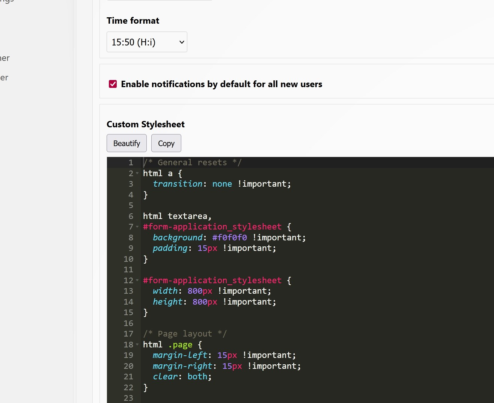

# CSS Stylesheet Editor – ACE (Kanboard plugin)

**Version:** v1.0.0  
**Author:** R.Valentin — RIVDESIGN.fr



## Overview
Replaces the **Custom Stylesheet** textarea on **Settings → Application** with an ACE (Ajax.org Cloud9 Editor) CSS editor ( https://ace.c9.io/ ). CSP-safe: ACE scripts are served locally from the plugin.

## Features
- CSS syntax highlighting (ACE)
- Beautify button
- Copy to clipboard button
- Responsive height (~70% of viewport)
- English and French translations (en_US, fr_FR)

## Requirements
- Kanboard ≥ 1.2.x

## Installation
1. Copy this repository to:
   ```
   plugins/CssStylesheetEditorAce
   ```
2. This have the latest Ace version at the moment of release. You can use this or update by copying files from Add ACE runtime files at `ace-builds/src-min-noconflict/` into:
   ```
   plugins/CssStylesheetEditorAce/Assets/ace/
       ace.js
       ext-beautify.js
       mode-css.js
       theme-monokai.js
       worker-css.js
   ```
3. Open **Settings → Application → Custom Stylesheet**.

## Configuration
- Height (in `Assets/init.js`):
  ```js
  var h = Math.floor(window.innerHeight * 0.7); // adjust factor
  ```
- Font size (optional):
  ```js
  editor.setFontSize(14); // px
  ```

## Localization
Locales included:
```
Locale/en_US/translations.php
Locale/fr_FR/translations.php
```
Strings are injected by:
```
Template/partials/i18n.php
```

## File tree
```
CssStylesheetEditorAce/
├─ Plugin.php
├─ Assets/
│  ├─ init.js
│  └─ ace/
│     ├─ ace.js
│     ├─ ext-beautify.js
│     ├─ mode-css.js
│     ├─ theme-monokai.js
│     └─ worker-css.js
├─ Template/
│  └─ partials/
│     └─ i18n.php
└─ Locale/
   ├─ en_US/
   │  └─ translations.php
   └─ fr_FR/
      └─ translations.php
```
## Credits & Thanks 
ACE Editor Team :  https://ace.c9.io/ | Please show gratitude on https://github.com/ajaxorg/ace

## Changelog
- v1.0.0 — Initial release

If this helps you, you cand throw me a 🦴 or a ☕︎ via PayPal
http://paypal.me/RIVDESIGN
Thanks.
